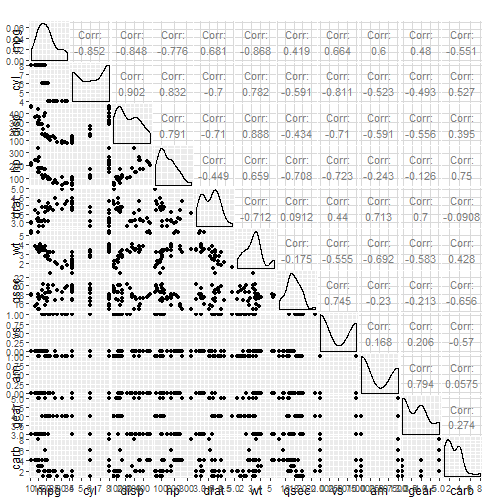

## Motor Trend Car Road Tests

### Description

The data was extracted from the 1974 Motor Trend US magazine, and comprises fuel consumption and 10 aspects of automobile design and performance for 32 automobiles (1973–74 models).


[, 1]	 mpg	 Miles/(US) gallon
[, 2]	 cyl	 Number of cylinders
[, 3]	 disp	 Displacement (cu.in.)
[, 4]	 hp	 Gross horsepower
[, 5]	 drat	 Rear axle ratio
[, 6]	 wt	 Weight (1000 lbs)
[, 7]	 qsec	 1/4 mile time
[, 8]	 vs	 V/S
[, 9]	 am	 Transmission (0 = automatic, 1 = manual)
[,10]	 gear	 Number of forward gears
[,11]	 carb	 Number of carburetors
Source

Henderson and Velleman (1981), Building multiple regression models interactively. Biometrics, 37, 391–411.

--- .class #id 

## Summary of Regression Model

Based on the coefficients, it seems that with moving from automatic to manual 2.5 units increase in the `mpg` accounting for all the other parameters. Now, we build 5 models with `am`, `wt` (weight), `qsec` (1/4 mile time), and `cyl` (number of cylinders).


```r
data("mtcars")
summary(lm(mpg ~ ., data = mtcars))$coefficients
```

```
##                Estimate  Std. Error    t value   Pr(>|t|)
## (Intercept) 12.30337416 18.71788443  0.6573058 0.51812440
## cyl         -0.11144048  1.04502336 -0.1066392 0.91608738
## disp         0.01333524  0.01785750  0.7467585 0.46348865
## hp          -0.02148212  0.02176858 -0.9868407 0.33495531
## drat         0.78711097  1.63537307  0.4813036 0.63527790
## wt          -3.71530393  1.89441430 -1.9611887 0.06325215
## qsec         0.82104075  0.73084480  1.1234133 0.27394127
## vs           0.31776281  2.10450861  0.1509915 0.88142347
## am           2.52022689  2.05665055  1.2254035 0.23398971
## gear         0.65541302  1.49325996  0.4389142 0.66520643
## carb        -0.19941925  0.82875250 -0.2406258 0.81217871
```

---

## Exploratory Plot


```
## Warning in ggpairs(mtcars, colour = "am", alpha = 0.4): Extra arguments:
## "colour", "alpha" are being ignored. If these are meant to be aesthetics,
## submit them using the 'mapping' variable within ggpairs with ggplot2::aes
## or ggplot2::aes_string.
```

 


---
## Shiny App

The Shiny App uses three of the most important factors to plot their effects on `mpg` with respect to the `automatic` versus `manual` transmission.
The app can be found here at:
[Slidify App](https://shobeir.shinyapps.io/data_product/)


